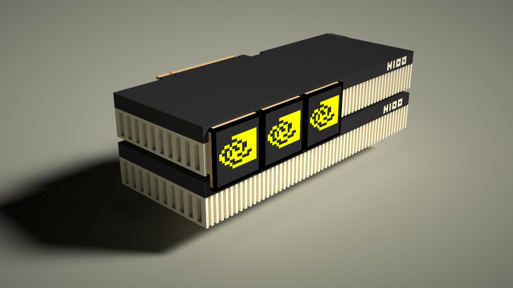
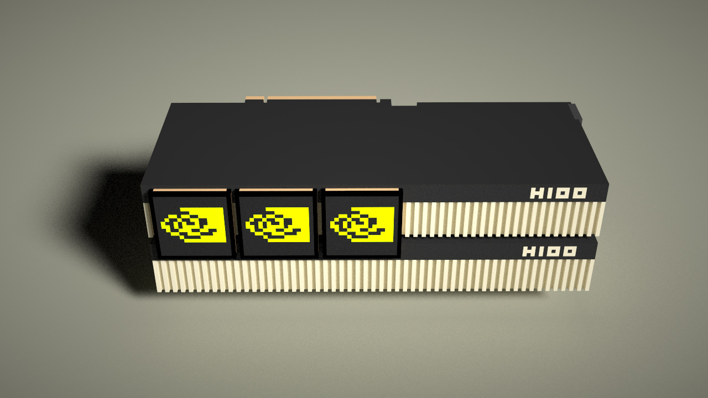
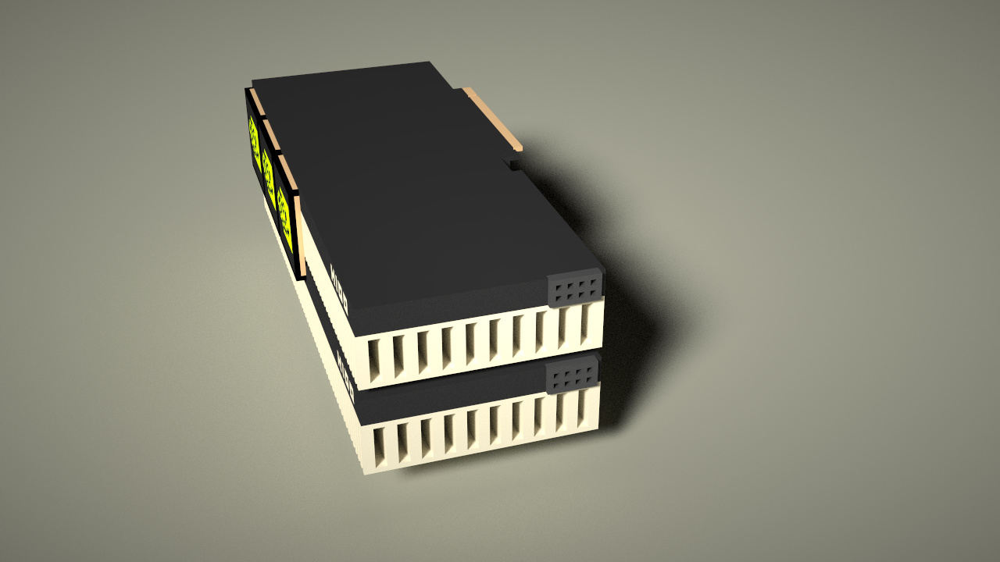
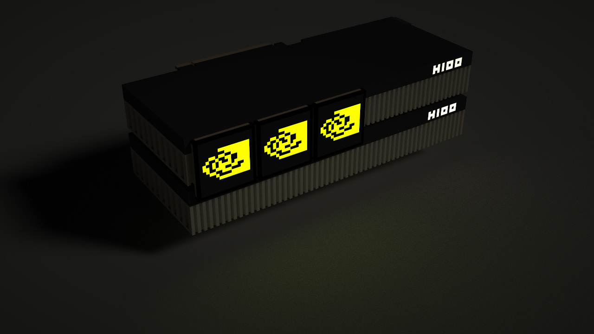

# <a name="title">Taichi Voxel Challenge: Nvidia GPU H100</a>

<p align="center">
</img>
</p>

<p align="center">
</img>
</p>

<p align="center">
</img>
</p>

<p align="center">
</img>
</p>


## Inspiration

I have always been hoping to have my own Nvidia GPU for machine learning and computer graphics.

Hope in the future I can have one, LOL.

Here below is the Nvidia A100.

<p align="center">
</img>
</p>

## Installation

Make sure your `pip` is up-to-date:

```bash
pip3 install pip --upgrade
```

Assume you have a Python 3 environment, simply run:

```bash
pip3 install -r requirements.txt
```

to install the dependencies of the voxel renderer.
